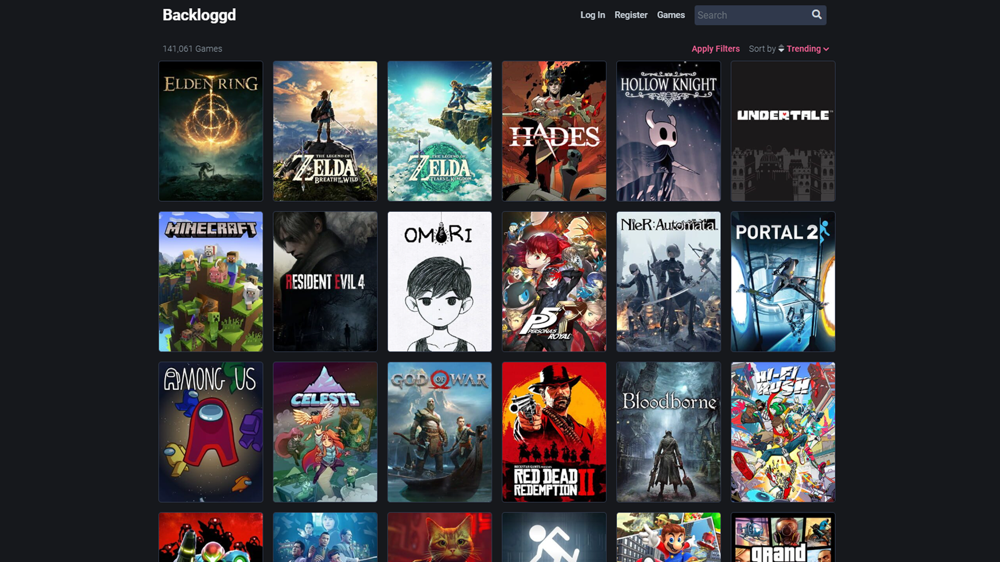
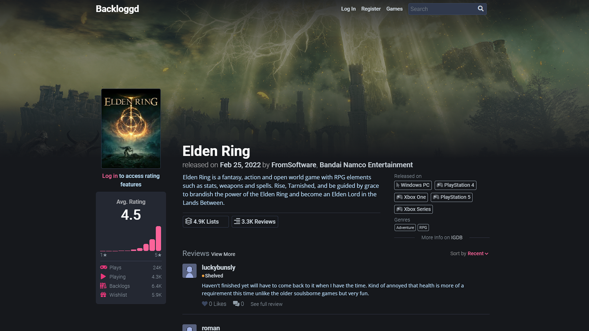

# backloggd.сsv
The dataset is obtained by extracting from a web resource page <a href=https://www.backloggd.com>backloggd.com</a> using your own written parser program. 
The dataset contains information on over **90,000 games** and **20,000 developers**, over **150 game platforms** and **20 genres**.

## About the web resource backloggd.com
"**Backloggd** is a place to keep your personal video game collection. Every game from every platform is here for you to log into your journal. Follow friends along the way to share your reviews and compare ratings. Then use filters to sort through your collection and see what matters to you. Keep a backlog of what you are currently playing and what you want to play, see the numbers change as you continue to log your playthroughs. There's Goodreads for books, Letterboxd for movies, and now Backloggd for games." - from the site <a href=https://www.backloggd.com>backloggd.com</a>

The site provides information about video games:
- the name of the video game;
- date of release;
- a list of genres to which the video game belongs;
- a list of companies that took part in the development of the video game;
- a list of platforms for which the video game was released;
- video game rating;
- description of the video game;
- quantitative indicators, such as:
    - the number of players who have played the video game since its release;
    - the number of players who are currently playing the video game;
    - the number of reviews left about the video game;
    - the number of users who added the video game to the backlogs (i.e. purchased it but haven't played it yet);
    - the number of users who have added a video game to wishlists (i.e. would like to purchase it);
    
"All game related metadata comes from the community driven database <a href=https://www.igdb.com>IGDB</a>. This includes all game, company and platform data you see on the site." - from the site <a href=https://www.backloggd.com>backloggd.com</a>

## Dataset fields
- **name** - video game name;
- **date** - video game release date;
- **developers** - list of video game developers;
- **rating** - video game rating;
- **platforms** - list of gaming platforms for which the game was released;
- **genres** - list of video game genres;
- **category** - video game release category (main game, DLS, mod, addon, expansion, remake, etc.);
- **main** - name of the main video game (if the game is the main one, this field will duplicate the "name" field);
- **reviews** - the number of reviews for this video game;
- **plays** - the number of players who have played this game for all time;
- **playing** - number of players currently playing;
- **backlogs** - number of users who added this game to backlogs;
- **wishlists** - number of users who added this game to wishlists;
- **description** - video game description.

[Project information](../../README.md)